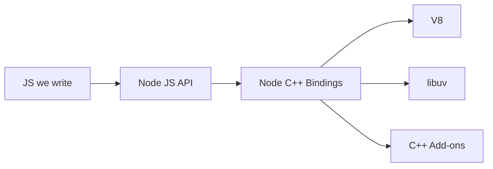

# Nodejs
## Internals
 - Built in JS and C++ with dependency of V8 (JS/C++) and libuv (C++)
 - V8 is a JS engine that interprets/compiles JS into machine code using JIT 
 - libuv is a C++ library that provide OS access (Event Loop, Thread Pool(size:4), Async IO, etc)
 - Nodejs connects JS and C++ using `process.binding()`, e.g. PBKDF2
## Event Loop
 - Provided by libuv, **not** V8
 - Move completed tasks from event queues to the stack in V8 for execution in the main thread
### Microtask queue vs Marcotask queue
 - Two event queues for two types of tasks, microtasks and macrotasks
 - Microtasks take priority over macrotasks
 - Microtasks include `Promise.then()` and `process.nextTick()`
 - Macrotasks include `setTimeout()`, I/O callbacks, etc.
## Architecture

