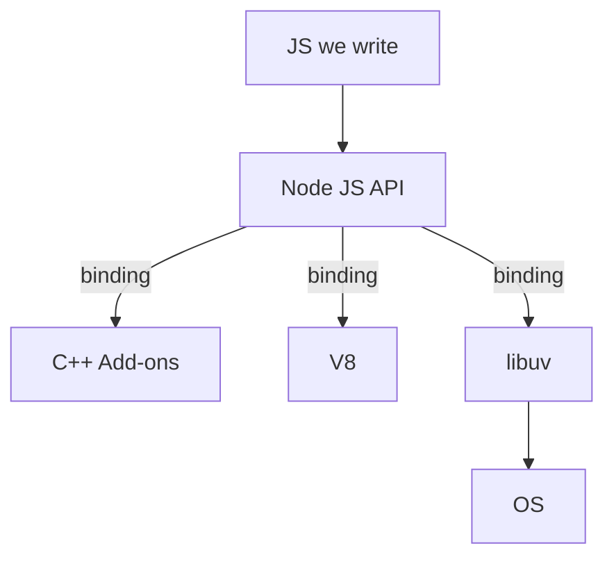

# Nodejs
## Internals
 - nodejs is built using JS and C++ using V8 (JS/C++) and libuv (C++)
 - V8 is a JS engine that interprets/compiles JS into machine coding using JIT 
 - libuv is a C++ library that provide OS access
   - Event Loop, Thread Pool, Async IO
 - nodejs connects JS and C++ using `process.binding()`, e.g. PBKDF2
### Dependency

